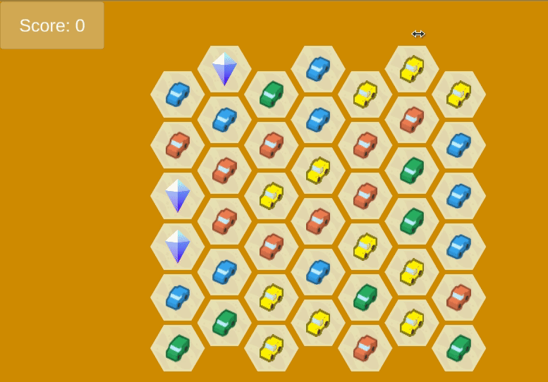

# Hypercasual Match 3 Game Example

A match3 game example game.

License for only source code is CC0, and for the whole Unity project is CC 4.0.

Sound: https://kronbits.itch.io/freesfx

Art assets: https://opengameart.org/content/gem-icons-0 and https://kenney.nl/assets/hexagon-pack
